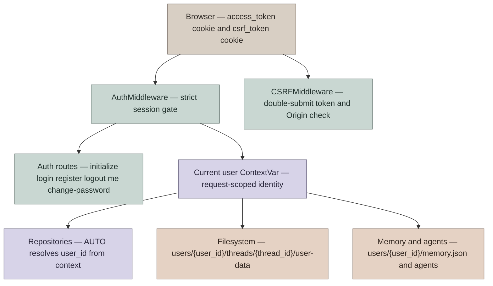
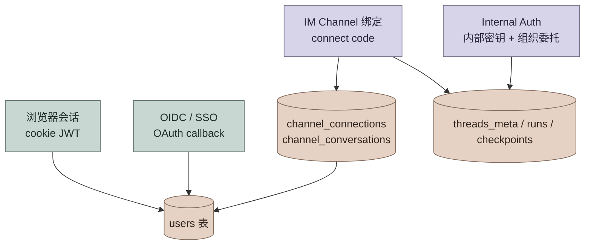

# 用户认证与隔离设计

本文档描述 DeerFlow 当前内置认证模块的设计，而不是历史 RFC。它覆盖浏览器登录、OIDC/SSO、平台信任接入（IM Channel 与 Internal Auth）、API 认证、CSRF、用户隔离、首次初始化、密码重置和升级迁移。

## 设计目标

认证模块的核心目标是把 DeerFlow 从“本地单用户工具”提升为“可多用户部署的 agent runtime”，并让用户身份贯穿 HTTP API、LangGraph-compatible runtime、文件系统、memory、自定义 agent 和反馈数据。

设计约束：

- 默认强制认证：除健康检查、文档和 auth bootstrap 端点外，HTTP 路由都必须有有效 session。
- 服务端持有所有权：客户端 metadata 不能声明 `user_id` 或 `owner_id`。
- 隔离默认开启：repository（仓储）、文件路径、memory、agent 配置默认按当前用户解析。
- 旧数据可升级：无认证版本留下的 thread 可以在 admin 存在后迁移到 admin。
- 密码不进日志：首次初始化由操作者设置密码；`reset_admin` 只写 0600 凭据文件。

非目标：

- 当前用户角色只有 `admin` 和 `user`，尚未实现细粒度 RBAC。
- 当前登录限速是进程内字典，多 worker 下不是全局精确限速。

## 核心模型



### 用户表

用户记录定义在 `app.gateway.auth.models.User`，持久化到 `users` 表。关键字段：

| 字段 | 语义 |
|---|---|
| `id` | 用户主键，JWT `sub` 使用该值 |
| `email` | 唯一登录名 |
| `password_hash` | bcrypt hash，OAuth 用户可为空 |
| `system_role` | `admin` 或 `user` |
| `needs_setup` | reset 后要求用户完成邮箱 / 密码设置 |
| `token_version` | 改密码或 reset 时递增，用于废弃旧 JWT；管理员强制登出也走这个字段 |
| `disabled_at` | 管理员禁用该账号的时间，为空表示账号可用 |

### 运行时身份

认证成功后，`AuthMiddleware` 把用户同时写入：

- `request.state.user`
- `request.state.auth`
- `deerflow.runtime.user_context` 的 `ContextVar`

`ContextVar` 是这里的核心边界。上层 Gateway 负责写入身份，下层 persistence / file path 只读取结构化的当前用户，不反向依赖 `app.gateway.auth` 具体类型。

可以把 repository 调用的用户参数理解成一个三态 ADT：

```scala
enum UserScope:
  case AutoFromContext
  case Explicit(userId: String)
  case BypassForMigration
```

对应 Python 实现是 `AUTO | str | None`：

- `AUTO`：从 `ContextVar` 解析当前用户；没有上下文则抛错。
- `str`：显式指定用户，主要用于测试或管理脚本。
- `None`：跳过用户过滤，只允许迁移脚本或 admin CLI 使用。

## 登录与初始化流程

### 首次初始化

首次启动时，如果没有 admin，服务不会自动创建账号，只记录日志提示访问 `/setup`。

流程：

1. 用户访问 `/setup`。
2. 前端调用 `GET /api/v1/auth/setup-status`。
3. 如果返回 `{"needs_setup": true}`，前端展示创建 admin 表单。
4. 表单提交 `POST /api/v1/auth/initialize`。
5. 服务端确认当前没有 admin，创建 `system_role="admin"`、`needs_setup=false` 的用户。
6. 服务端设置 `access_token` HttpOnly cookie，用户进入 workspace。

`/api/v1/auth/initialize` 只在没有 admin 时可用。并发初始化由数据库唯一约束兜底，失败方返回 409。

### 普通登录

`POST /api/v1/auth/login/local` 使用 `OAuth2PasswordRequestForm`：

- `username` 是邮箱。
- `password` 是密码。
- 成功后签发 JWT，放入 `access_token` HttpOnly cookie。
- 响应体只返回 `expires_in` 和 `needs_setup`，不返回 token。

登录失败会按客户端 IP 计数。IP 解析只在 TCP peer 属于 `AUTH_TRUSTED_PROXIES` 时信任 `X-Real-IP`，不使用 `X-Forwarded-For`。阈值与锁定时长可通过 `auth.local.max_login_attempts`（默认 5）和 `auth.local.lockout_seconds`（默认 300 秒）配置，按次实时读取，改配置后下一次登录即生效，无需重启 Gateway（`max_login_attempts` 最小为 2：单次失败不得锁定 IP。时长热改按方向生效：下调可提前释放进行中的锁定、收紧阈值会保留已计数的失败；上调只延长仍在锁定期内的锁定，不会复活已服满原时长的锁定）。

### 双因素认证（TOTP MFA）

密码账号可以额外启用基于时间的一次性密码（TOTP，RFC 6238），标准 30 秒步长、6 位数字，校验时允许当前步前后各一步的时钟漂移。实现只用标准库（`hmac`、`hashlib`、`base64`），未引入第三方 TOTP 依赖，见 `app/gateway/auth/totp.py`，并用 RFC 6238 附录 B 的官方测试向量校验（`tests/test_totp.py`）。

新表 `user_mfa`（迁移 `0036_user_mfa`，`down_revision` 为 `0035_fleet_agent_bindings`）：每个用户一行，`user_id` 外键指向 `users.id`（级联删除）；`secret_encrypted` 是加密后的 TOTP 密钥；`enabled_at` 为空表示已开始但尚未确认的注册流程；`recovery_codes` 是一个 JSON 列表，保存十个一次性恢复码的哈希（含各自的 `used_at`），原始恢复码只在确认注册时展示一次，不落库。

密钥加密：`app/gateway/auth/mfa_crypto.py` 用部署已有的 JWT 密钥（`AUTH_JWT_SECRET`，或回退到持久化的 `.jwt_secret` 文件）通过 HMAC-SHA256 派生一把独立的 Fernet 密钥，不需要再单独配置和备份一份 MFA 专用密钥；派生方式和 `ChannelCredentialCipher.from_key` 已有的 sha256 摘要派生 Fernet key 的做法一致。

流程：

1. `POST /api/v1/auth/mfa/enroll/start`（需要交互式 session，PAT 不可用）：生成新密钥并以未确认状态持久化，返回 `otpauth://` URI 和明文密钥供手动输入。重复调用会覆盖上一次未确认的密钥。
2. `POST /api/v1/auth/mfa/enroll/confirm`：提交一次有效验证码后，标记 `enabled_at`，生成十个恢复码并一次性返回（`app/gateway/auth/recovery_codes.py`：`secrets` 生成、哈希持久化、`hmac.compare_digest` 常量时间比对）。
3. `POST /api/v1/auth/mfa/disable`：需要账号密码加一个验证码或恢复码，成功后整行删除（重新启用需要重新走一遍注册流程）。
4. 登录：`POST /api/v1/auth/login/local` 密码验证通过后，如果该账号已启用 MFA，不签发 session，而是返回 `{"mfa_required": true, "challenge": "..."}`；`challenge` 是一个短期（5 分钟）、签名、单次有效的 JWT（`typ=mfa_challenge`，与普通 access token 用同一密钥签名但 `typ` 声明不同，二者不能互相冒用）。`POST /api/v1/auth/login/mfa` 用 `challenge` 加验证码或恢复码换取真正的 session。

限速：`challenge` 本身在进程内按 `jti` 记录尝试次数，超过 5 次或过期即失效，必须重新登录密码；同时复用登录页已有的按 IP 限速桶，以及一个跨 `login/mfa`、`enroll/confirm`、`disable` 共享的按用户限速桶（`mfa:{user_id}`），避免绕过某一个端点的限速重新获得尝试预算。和登录限速一样，这些计数器是进程内字典，多 worker 部署下只是近似限速。

审计：`mfa.enabled`、`mfa.disabled`、`mfa.challenge.failed`、`mfa.recovery_code.used` 均走 `record_audit_event`。`disabled_at` 非空的账号在 `login/mfa` 换取 session 时会被显式拒绝（`get_local_provider().get_user()` 之后重新检查一次），管理端点（enroll/disable）则复用 `get_current_user_from_request` 已有的 disabled 检查。

前端：Settings 的 Security 标签页提供注册（含二维码，用已安装的 `qrcode.react`，同时展示 `otpauth://` 链接和密钥供手动输入）、确认、恢复码复制、关闭四个环节；登录页在收到 `mfa_required` 后展示第二步，接受 6 位验证码或恢复码。

### 注册

`POST /api/v1/auth/register` 创建普通 `user`，并自动登录。

当前实现允许在没有 admin 时注册普通用户，但 `setup-status` 仍会返回 `needs_setup=true`，因为 admin 仍不存在。这是当前产品策略边界：如果后续要求“必须先初始化 admin 才能注册普通用户”，需要在 `/register` 增加 admin-exists gate。

### 改密码与 reset setup

`POST /api/v1/auth/change-password` 需要当前密码和新密码：

- 校验当前密码。
- 更新 bcrypt hash。
- `token_version += 1`，使旧 JWT 立即失效。
- 重新签发 cookie。
- 如果 `needs_setup=true` 且传了 `new_email`，则更新邮箱并清除 `needs_setup`。

`python -m app.gateway.auth.reset_admin` 会：

- 找到 admin 或指定邮箱用户。
- 生成随机密码。
- 更新密码 hash。
- `token_version += 1`。
- 设置 `needs_setup=true`。
- 写入 `.deer-flow/admin_initial_credentials.txt`，权限 `0600`。

命令行只输出凭据文件路径，不输出明文密码。

## HTTP 认证边界

`AuthMiddleware` 是 fail-closed（默认拒绝）的全局认证门。

公开路径：

- `/health`
- `/docs`
- `/redoc`
- `/openapi.json`
- `/api/v1/auth/login/local`
- `/api/v1/auth/register`
- `/api/v1/auth/logout`
- `/api/v1/auth/setup-status`
- `/api/v1/auth/initialize`
- `/api/v1/auth/providers`
- `/api/v1/auth/oauth/` (所有子路径)
- `/api/v1/auth/callback/` (所有子路径)

其余路径都要求有效 `access_token` cookie。存在 cookie 但 JWT 无效、过期、用户不存在或 `token_version` 不匹配时，直接返回 401，而不是让请求穿透到业务路由。

路由级别的 owner check 由 `require_permission(..., owner_check=True)` 完成：

- 读类请求允许旧的未追踪 legacy thread 兼容读取。
- 写 / 删除类请求使用 `require_existing=True`，要求 thread row 存在且属于当前用户，避免删除后缺 row 导致其他用户误通过。

## CSRF 设计

DeerFlow 使用 Double Submit Cookie：

- 服务端设置 `csrf_token` cookie。
- 前端 state-changing 请求发送同值 `X-CSRF-Token` header。
- 服务端用 `secrets.compare_digest` 比较 cookie/header。

需要 CSRF 的方法：

- `POST`
- `PUT`
- `DELETE`
- `PATCH`

auth bootstrap 端点（login/register/initialize/logout）不要求 double-submit token，因为首次调用时浏览器还没有 token；但这些端点会校验 browser `Origin`，拒绝 hostile Origin，避免 login CSRF / session fixation。

## 用户隔离

### Thread metadata

Thread metadata 存在 `threads_meta`，关键隔离字段是 `user_id`。

创建 thread 时：

- 客户端传入的 `metadata.user_id` 和 `metadata.owner_id` 会被剥离。
- `ThreadMetaRepository.create(..., user_id=AUTO)` 从 `ContextVar` 解析真实用户。
- `/api/threads/search` 默认只返回当前用户的 thread。

读取 / 修改 / 删除时：

- `get()` 默认按当前用户过滤。
- `check_access()` 用于路由 owner check。
- 对其他用户的 thread 返回 404，避免泄露资源存在性。

### 文件系统

当前线程文件布局：

```text
{base_dir}/users/{user_id}/threads/{thread_id}/user-data/
├── workspace/
├── uploads/
└── outputs/
```

agent 在 sandbox 内看到统一虚拟路径：

```text
/mnt/user-data/workspace
/mnt/user-data/uploads
/mnt/user-data/outputs
```

`ThreadDataMiddleware`、`UploadsMiddleware` 与 memory 读写路径统一使用
`resolve_runtime_user_id(runtime)` 解析当前用户。当前 LangGraph runtime
优先使用 server-owned 的 `runtime.server_info.user.identity`；旧版或缺少
`server_info` 的 standalone 路径继续读取 server-owned 的
`configurable.langgraph_auth_user_id`；Gateway 内嵌路径在没有 Agent Server
认证身份时使用认证后注入的 `runtime.context.user_id`。LangGraph 允许
`BaseUser.identity` 使用邮箱等任意非空字符串，因此 server-owned auth
身份会先通过 `make_safe_user_id` 转换为稳定、抗碰撞且目录安全的 DeerFlow
storage ID；Agent Server 自身用于 metadata 授权过滤的原始 identity 不变。
这些通道都缺失时才回落到请求 ContextVar 和 `default` 用户桶，最后一级
主要用于内部调用、嵌入式 client 或无 HTTP 的本地执行路径。

lead-agent 工厂使用同一身份边界：Agent Server 的保留 auth 字段优先于普通
`user_id`，并将解析结果显式传给 custom agent、SOUL、skills、skill policy
与静态 prompt 构建，避免 graph 构建阶段和 middleware 执行阶段落入不同用户桶。

### Memory

默认 memory 存储：

```text
{base_dir}/users/{user_id}/memory.json
{base_dir}/users/{user_id}/agents/{agent_name}/memory.json
```

有用户上下文时，空或相对 `memory.storage_path` 都使用上述 per-user 默认路径；只有绝对 `memory.storage_path` 会视为显式 opt-out（退出） per-user isolation，所有用户共享该路径。无用户上下文的 legacy 路径仍会把相对 `storage_path` 解析到 `Paths.base_dir` 下。

### 自定义 agent

用户自定义 agent 写入：

```text
{base_dir}/users/{user_id}/agents/{agent_name}/
├── config.yaml
├── SOUL.md
└── memory.json
```

旧布局 `{base_dir}/agents/{agent_name}/` 只作为只读兼容回退。更新或删除旧共享 agent 会要求先运行迁移脚本。

## 认证方式总览

DeerFlow 支持四类彼此独立的 HTTP 身份来源。它们共享同一套 **thread / run 隔离语义**（`threads_meta.user_id`、`runs.user_id`、`.deer-flow/users/{user_id}/threads/...`），但在 **是否写入 `users` 表** 和 **外部身份如何映射** 上不同。

| 方式 | 典型入口 | 写入 `users` 表 | 外部身份映射 | 用户 / thread 隔离 |
|---|---|---|---|---|
| **浏览器本地账号** | `POST /api/v1/auth/login/local` 或 `/register` → `access_token` cookie | 是 | 邮箱即 DeerFlow `users.id` | `threads_meta.user_id = users.id` |
| **OIDC / SSO** | `GET /api/v1/auth/oauth/{provider}` → callback → cookie | 是（自动创建或关联） | IdP `sub` → `users.oauth_id` | 同上 |
| **IM Channel 绑定** | Settings 里 Connect + 平台侧 `/connect <code>` | 绑定到**已注册** DeerFlow 用户 | `channel_connections` / `channel_conversations` | `owner_user_id` → `users.id` |
| **Internal Auth（组织委托）** | `X-DeerFlow-Internal-Token` + `X-DeerFlow-Delegation-Id` | **否**（合成 internal 用户，以委托 owner 行事） | `organization_delegations` 把调用方绑定到一个 active 成员 | 委托组织的 storage principal 与 `organization_id` |



OIDC 细节见 [SSO.md](SSO.md)。IM 绑定细节见 [IM_CHANNEL_CONNECTIONS.md](IM_CHANNEL_CONNECTIONS.md)。

## Google 单点登录配置

Google 走的是完全通用的 OIDC 流程（`app/gateway/auth/oidc.py`），代码层面不需要为 Google 单独写任何分支；`allowed_email_domains`、`auto_create_users`、`require_verified_email`、`admin_emails` 这些用户准入策略对所有 provider 都一样生效，包括限定到某个 Google Workspace 域名。登录页会在 `GET /api/v1/auth/providers` 返回启用的 provider 后自动展示对应按钮（`t.login.continueWith(display_name)`），前端不需要为 Google 单独改代码。

在 Google Cloud Console 完成以下步骤，拿到 `client_id` 和 `client_secret`：

1. 打开 [Google Cloud Console](https://console.cloud.google.com/)，新建或选择一个项目。
2. 进入“API 和服务”下的“OAuth 同意屏幕”，选择用户类型（选“内部”仅允许本组织的 Google Workspace 账号登录；选“外部”允许任意 Google 账号，可以再用 `allowed_email_domains` 收紧到指定域名），填写应用名称和支持邮箱等必填信息。
3. 进入“API 和服务”下的“凭据”，点击“创建凭据”，选择“OAuth 客户端 ID”，应用类型选“Web 应用”。
4. 在“已获授权的重定向 URI”中加入：

   ```text
   https://<你的部署域名>/api/v1/auth/callback/google
   ```

   本地开发再加一条：

   ```text
   http://localhost:2026/api/v1/auth/callback/google
   ```

5. 创建后会拿到一个客户端 ID 和一个客户端密钥。密钥只显示一次，立即保存。
6. 把客户端密钥放进环境变量，不要写进 `config.yaml` 明文：

   ```bash
   export GOOGLE_OAUTH_CLIENT_ID="<客户端 ID>"
   export GOOGLE_OAUTH_CLIENT_SECRET="<客户端密钥>"
   ```

7. 在 `config.yaml` 里把 `auth.oidc.enabled` 设为 `true`，按 `config.example.yaml` 里注释掉的 `google:` 示例块打开一份，`client_id` 填 `$GOOGLE_OAUTH_CLIENT_ID`，`client_secret` 填 `$GOOGLE_OAUTH_CLIENT_SECRET`；只允许某个 Workspace 域名登录时设置 `allowed_email_domains`。`issuer` 填 `https://accounts.google.com` 即可，Google 的 discovery 端点是标准的 `https://accounts.google.com/.well-known/openid-configuration`，不需要再单独配置 `authorization_endpoint`、`token_endpoint`、`jwks_uri`。
8. 重启 Gateway 使配置生效。

本仓库不会创建也不会持有任何真实的 Google OAuth 客户端凭据；以上步骤由部署者在自己的 Google Cloud 项目中完成。

## 平台信任接入

**IM Channel 绑定** 与 **Internal Auth** 可归为同一大类：**平台信任模型**——DeerFlow 把渠道/合作平台视为已认证边界，由平台把“自己的用户”映射到 DeerFlow 的运行时身份，而不是让每个终端用户再走 DeerFlow 注册登录。

| 维度 | IM Channel 绑定（子类 A） | Internal Auth 组织委托（子类 B） |
|---|---|---|
| 平台凭证 | `channels.*` 机器人配置 + Gateway 内部调用 + 连接委托 | 部署级 `DEER_FLOW_INTERNAL_AUTH_TOKEN` + 委托 id |
| DeerFlow 用户来源 | 必须绑定到 `users` 表中的真实账号 | 委托 owner 必须是 active 组织中的 active 成员 |
| 外部身份登记 | `channel_connections` + `channel_conversations`（可审计、可撤销） | `organization_delegations`（可审计、可撤销、可过期） |
| 典型调用方 | DeerFlow 内置 IM worker（飞书 / 企业微信 / Slack / Telegram …） | scheduler、MCP 通知、经授权的合作方后端 |
| 身份可信度 | Connect code 一次性绑定，DB 唯一约束保证单 owner | 每次请求重新校验委托与 owner 成员身份；owner header 只能与委托一致 |
| 用户 / thread 隔离 | 有（按绑定 owner 的私有组织） | 有（按委托组织的 storage principal 与 `organization_id`） |
| 本地文件布局 | `.deer-flow/users/{owner}/threads/{thread_id}/...` | `.deer-flow/users/{storage principal}/threads/{thread_id}/...` |

两类接入在 run 生命周期上共用同一持久化面：`threads_meta`、`runs`、`run_events`、`checkpoints`、`checkpoint_blobs` 都按解析后的 storage principal 与 `organization_id` 做隔离。

### Internal Auth：只经由组织委托（delegation）

企业运行时契约第 4 节：内部 token 加 `X-DeerFlow-Owner-User-Id` **本身永远不够**。每个内部调用方（定时任务、MCP 任务、IM 连接等）都必须出示一条持久化、处于 active 状态的 `organization_delegations` 记录，把该调用方绑定到某个组织中的一个真实 owner。

#### 配置

```bash
export DEER_FLOW_INTERNAL_AUTH_TOKEN="<long-random-secret>"
```

未配置时 Gateway 会为每个 worker 进程生成随机 token；生产环境应显式配置，并仅在内网调用链中分发。token 只证明调用方是 Gateway 自己的内部组件，不授予任何用户或组织身份。

#### 请求头

| Header | 必填 | 说明 |
|---|---|---|
| `X-DeerFlow-Internal-Token` | 是 | 必须等于 `DEER_FLOW_INTERNAL_AUTH_TOKEN` |
| `X-DeerFlow-Delegation-Id` | 是 | 调用方的委托 id（`create_internal_auth_headers(delegation_id=...)`） |
| `X-DeerFlow-Owner-User-Id` | 否 | 若发送，必须等于委托的 owner；不一致即拒绝 |

`AuthMiddleware` 每次请求都按 id 重新读取委托（`OrganizationDelegationRepository.resolve_delegation_by_id`），并要求：状态为 active、未过期、scopes 非空、owner 在一个 active 组织中拥有 active 成员身份、owner header（如有）一致。任一不满足，或根本没有委托（只有 token，或 token 加 owner header），都返回 `403 Internal calls require an active organization delegation` 并记录一条 `Rejected internal call without a matching active delegation` 日志。

通过后，请求以委托 owner 的身份（`actor_user_id`）在委托所属组织（`organization_id`）内、以该组织的 storage principal（私有组织为 owner 本人，共享工作区为其 storage 用户）执行，与浏览器会话完全相同的组织过滤随之生效；路由权限再与委托 scopes 取交集，和 PAT scopes 一样只能收窄。`get_trusted_internal_owner_user_id()` 只对已验证委托的请求返回其 storage principal，owner header 本身从不被信任；artifact、memory、线程 owner check 均不再有 header 兜底。仅在显式 auth-disabled 模式（开发/E2E）下保留旧的合成内部身份。

#### 委托来源

| 调用方 | subject_type / subject_id | scopes | 授予 / 撤销 |
|---|---|---|---|
| 定时任务 | `scheduled_task` / 任务 id | `runs:create` | 创建时授予创建者；删除时撤销 |
| MCP 任务通知 | `mcp_task` / 任务 id | `runs:create` | 创建时授予当前操作成员 |
| IM 连接 worker | `channel_connection` / 连接 id | `threads:read`、`threads:write`、`runs:create`、`runs:read` | 连接（connect）时授予；断开、转移、provider 移除时撤销 |

迁移 `0032_org_delegation_backfill` 为已有的、带组织戳的上述对象补发委托（id 前缀 `dlg0032-`，downgrade 只删除这些行）。没有 active owner 的对象保持无委托，fail closed。

进程内启动器（scheduler、MCP 通知）不走 HTTP，但构造完全相同的身份：`services._delegated_internal_request()` 从已解析的委托设置 `organization_id` / `storage_user_id` / `actor_user_id` / `delegation_id`，不发送 owner header，并在同一 storage context 中调用 `start_run`。storage principal 与委托 owner 不同（共享工作区）时，同样要求隔离的 AIO sandbox。

撤销立即生效：新请求被拒绝；已打开的 SSE 流在每次心跳时重新检查成员身份（内部调用方则重新检查整个委托），一旦失效即关闭。

#### 集成方式

第三方平台不再能以“共享 token + 自声明 owner”方式直接调用。需要代表用户调用时，应由 DeerFlow 为该集成授予一条委托（owner 必须是真实的 active 成员），平台随每次请求出示该委托 id；委托可随时撤销，owner 失去成员身份也会使其失效。

### IM Channel 绑定（子类 A）

IM worker 通过 Gateway 内部 HTTP 调用 agent runtime，并携带：

- `X-DeerFlow-Internal-Token`
- 匹配的 CSRF cookie / `X-CSRF-Token`（进程内生成，供 worker 使用）
- 绑定成功后附带连接的委托 id（`X-DeerFlow-Delegation-Id`）与 `X-DeerFlow-Owner-User-Id`（来自 `channel_connections.owner_user_id`，对应 `users.id`）；未绑定或委托已撤销的消息会被 Gateway 拒绝

渠道后台任务在空的 ContextVar 上下文中启动（`ChannelService._start_channel`），因此即使重启发生在某个 HTTP 请求内，也不会继承该请求的用户身份；每条消息只以其自身的 owner 与委托行事。

与 Internal Auth 直接 HTTP 相比，IM 路径多了 **connect-code 绑定** 与 **`users` 表关联**，外部身份可追溯、可撤销。配置与运维见 [IM_CHANNEL_CONNECTIONS.md](IM_CHANNEL_CONNECTIONS.md)。

## LangGraph-compatible 认证

Gateway 内嵌 runtime 路径由 `AuthMiddleware` 和 `CSRFMiddleware` 保护。

仓库仍保留 `app.gateway.langgraph_auth`，用于 LangGraph Server 直连模式：

- `@auth.authenticate` 校验 JWT cookie、CSRF、用户存在性和 `token_version`。
- `@auth.on` 在写入 metadata 时注入 `user_id`，并在读路径返回 `{"user_id": current_user}` 过滤条件。
- LangGraph Server 将认证结果写入运行配置的保留
  `langgraph_auth_user` / `langgraph_auth_user_id` 字段；harness 消费该身份，
  让 uploads、thread data 与 memory 在直连模式下继续使用正确的 per-user
  文件桶。
- Gateway 内嵌 runtime 不接受这两个保留字段：run config 组装后会从
  `context` 与 `configurable` 同时剥离客户端传入值，再注入 Gateway
  自己认证得到的 `runtime.context.user_id`，避免伪装成 Agent Server 身份。

这保证 Gateway 路由和 LangGraph-compatible 直连模式使用同一 JWT 语义。

## 升级与迁移

从无认证版本升级时，可能存在没有 `user_id` 的历史 thread。

当前策略：

1. 首次启动如果没有 admin，只提示访问 `/setup`，不迁移。
2. 操作者创建 admin。
3. 后续启动时，`_ensure_admin_user()` 找到 admin，并把 LangGraph store 中缺少 `metadata.user_id` 的 thread 迁移到 admin。

文件系统旧布局迁移由脚本处理：

```bash
cd backend
PYTHONPATH=. python scripts/migrate_user_isolation.py --dry-run
PYTHONPATH=. python scripts/migrate_user_isolation.py --user-id <target-user-id>
```

迁移脚本覆盖 legacy `memory.json`、`threads/` 和 `agents/` 到 per-user layout。

## 安全不变量

必须长期保持的不变量：

- JWT 只在 HttpOnly cookie 中传输，不出现在响应 JSON。
- 任何非 public HTTP 路由都不能只靠“cookie 存在”放行，必须严格验证 JWT。
- `token_version` 不匹配必须拒绝，保证改密码 / reset 后旧 session 失效。
- 客户端 metadata 中的 `user_id` / `owner_id` 必须剥离。
- repository 默认 `AUTO` 必须从当前用户上下文解析，不能静默退化成全局查询。
- 只有迁移脚本和 admin CLI 可以显式传 `user_id=None` 绕过隔离。
- 本地文件路径必须通过 `Paths` 和 sandbox path validation 解析，不能拼接未校验的用户输入。
- 捕获认证、迁移、后台任务异常必须记录日志；不能空 catch。
- `disabled_at` 非空的账号必须同时在登录（`LocalAuthProvider.authenticate`）和已有 session 校验（`get_current_user_from_request`）两处被拒绝；`disabled_at` 非空的账号在 `login/mfa` 换取 session 时也要被拒绝。
- MFA 验证码和恢复码必须常量时间比较（`verify_totp_code`、`recovery_code_matches`），且一次成功验证之后不能复用同一个恢复码或同一个 `challenge`。
- MFA 密钥必须加密存储，恢复码只能以哈希形式持久化；任何失败响应都不能透露具体是密码、验证码还是 `challenge` 本身出了问题。

## 审计日志与管理员操作

SOC 2 风格的最小控制集，为向外部客户开放做准备。

- **`audit_events` 表**（append only，迁移 `0033_audit_events`）记录 `occurred_at` / `actor_user_id` / `organization_id` / `action`（形如 `auth.login.succeeded` 的点分字符串）/ `target_type` / `target_id` / `outcome`（`success` / `denied` / `failed`）/ `ip` / `user_agent` / `details`（JSON）。`AuditEventRepository.record()` 永远不向请求路径抛异常：写入失败只记日志，不能让被审计的动作本身失败。
- `details` 在写入前统一走 `deerflow.persistence.audit_events.redact_audit_details`：键名包含 password / token / secret / cookie / api_key / authorization / credential / private_key / access_key / client_secret 等字样的值一律替换为 `"[redacted]"`。
- 已接入 `record`（一行调用，见 `app.gateway.deps.record_audit_event`）的动作：本地登录成功 / 失败、登出、改密码、PAT 创建 / 撤销、邀请创建 / 接受 / 撤销（含成员角色变更）、MCP 配置写入、managed model 保存、managed subagent 增改删、run 取消、MFA 启用 / 关闭 / 验证失败 / 恢复码使用（`mfa.enabled` / `mfa.disabled` / `mfa.challenge.failed` / `mfa.recovery_code.used`），以及下面三个管理员动作本身。
- **管理员操作**（`app/gateway/routers/admin.py`，`/api/admin/*`，`require_admin_user` 门禁，与 Models / MCP 配置同一断言）：`POST /users/{id}/disable`、`POST /users/{id}/enable`、`POST /users/{id}/force-logout`（复用已有的 `token_version` 机制），以及只读的 `GET /audit-events`（按 action 前缀 / actor / since / until 过滤，游标分页，跨组织，供系统管理员纵览整个部署）。
- 共享工作区邀请默认角色已改为 `member`（最小权限：不能管理成员、不能改组织设置），邀请人可显式选择 `admin`；见 `app/gateway/routers/invitations.py` 的 `CreateInvitationRequest.role`。

## 已知边界

| 边界 | 当前行为 | 后续方向 |
|---|---|---|
| 无 admin 时注册普通用户 | 允许注册普通 `user` | 如产品要求先初始化 admin，给 `/register` 加 gate |
| 登录限速 | 进程内 dict，单 worker 精确，多 worker 近似；MFA 的 challenge 尝试次数、按用户限速桶用同一进程内机制 | Redis / DB-backed rate limiter |
| OAuth / OIDC | 已实现通用 OIDC SSO（Keycloak, Google, Azure AD, Okta 等），支持 PKCE + nonce、auto-provisioning、email domain 限制（详见 [SSO.md](SSO.md)，Google Cloud Console 配置步骤见本文上方） | 支持 RP-initiated logout、自定义 scope 映射 |
| MFA | 仅支持密码账号的 TOTP；恢复码固定十个，用完需关闭重开 MFA 才能重新生成 | Sign in with Apple（App Store 阶段再做）、passkeys、WebAuthn |
| IM 用户隔离 | `channel_connections` 绑定到 `users.id`；未绑定消息在 `require_bound_identity: true` 时被拒绝 | 更多渠道与审计能力 |
| Internal Auth 泄露 token | token 加 owner header 不再足够；仍需一条 active 委托，且 owner header 必须与之一致 | 部署时轮换 token；委托 id 视为敏感标识，按需撤销 |
| 共享工作区邀请 | `authorization.invitations_frozen`（默认 true）下创建、查看、接受邀请均为 403；已有成员不受影响 | M3 隔离门禁完成、角色矩阵获批后再开放 |
| 无主 / 孤儿 thread | 对所有调用方 fail closed（404）；admin 可在 `GET /api/console/ownerless-threads` 只读列出其 id | 提供认领（claim）流程 |
| 绝对 memory path | 显式共享 memory | UI / docs 明确提示 opt-out 风险 |

## 相关文件

| 文件 | 职责 |
|---|---|
| `app/gateway/auth_middleware.py` | 全局认证门、JWT 严格验证、写入 user context |
| `app/gateway/csrf_middleware.py` | CSRF double-submit 和 auth Origin 校验 |
| `app/gateway/routers/auth.py` | initialize/login/register/logout/me/change-password + SSO OIDC 端点（providers/oauth/callback） |
| `app/gateway/auth/jwt.py` | JWT 创建与解析；同时定义 MFA challenge token（`typ=mfa_challenge`） |
| `app/gateway/auth/totp.py` | 标准库 TOTP（RFC 6238）：生成密钥、算码、常量时间校验、`otpauth://` URI |
| `app/gateway/auth/mfa_crypto.py` | 从已有 JWT 密钥派生的 MFA 密钥 Fernet 加解密 |
| `app/gateway/auth/recovery_codes.py` | 恢复码生成、哈希、常量时间比对 |
| `deerflow/persistence/user_mfa/` | `UserMfaRow` / `UserMfaRepository`（enroll/confirm/disable、恢复码单次使用） |
| `packages/harness/deerflow/persistence/migrations/versions/0036_user_mfa.py` | `user_mfa` 建表 |
| `app/gateway/auth/oidc.py` | OIDC 核心服务：discovery、token exchange、ID token 验证、userinfo |
| `app/gateway/auth/oidc_state.py` | OIDC state 管理：signed cookie 存储 state/nonce/code_verifier |
| `app/gateway/auth/user_provisioning.py` | OIDC 用户自动创建、email linking、domain 限制 |
| `app/gateway/auth/models.py` | 用户数据模型（含 `oauth_provider` / `oauth_id`） |
| `packages/harness/deerflow/config/auth_config.py` | OIDC 配置模型（OIDCProviderConfig / OIDCAuthConfig） |
| `app/gateway/auth/reset_admin.py` | 密码 reset CLI |
| `app/gateway/auth/credential_file.py` | 0600 凭据文件写入 |
| `app/gateway/authz.py` | 路由权限与 owner check |
| `app/gateway/routers/admin.py` | 管理员禁用 / 启用 / 强制登出用户、只读审计日志列表 |
| `deerflow/persistence/audit_events/` | `AuditEventRow` / `AuditEventRepository`（record 不抛异常、游标分页）/ `redact_audit_details` |
| `packages/harness/deerflow/persistence/migrations/versions/0033_audit_events.py` | `audit_events` 建表、`users.disabled_at` 加列 |
| `deerflow/runtime/user_context.py` | 当前用户 ContextVar 与 `AUTO` sentinel |
| `deerflow/persistence/thread_meta/` | thread metadata owner filter |
| `deerflow/config/paths.py` | per-user filesystem layout |
| `deerflow/agents/middlewares/thread_data_middleware.py` | run 时解析用户线程目录 |
| `deerflow/agents/memory/storage.py` | per-user memory storage |
| `deerflow/config/agents_config.py` | per-user custom agents |
| `app/channels/manager.py` | IM channel 内部认证调用与 owner header |
| `app/gateway/internal_auth.py` | Internal Auth header 常量、token 校验、合成用户 |
| `scripts/migrate_user_isolation.py` | legacy 数据迁移到 per-user layout |
| `.deer-flow/data/deerflow.db` | 统一 SQLite 数据库，包含 users / threads_meta / runs / feedback 等表 |
| `.deer-flow/users/{user_id}/agents/{agent_name}/` | 用户自定义 agent 配置、SOUL 和 agent memory |
| `.deer-flow/admin_initial_credentials.txt` | `reset_admin` 生成的新凭据文件（0600，读完应删除） |
